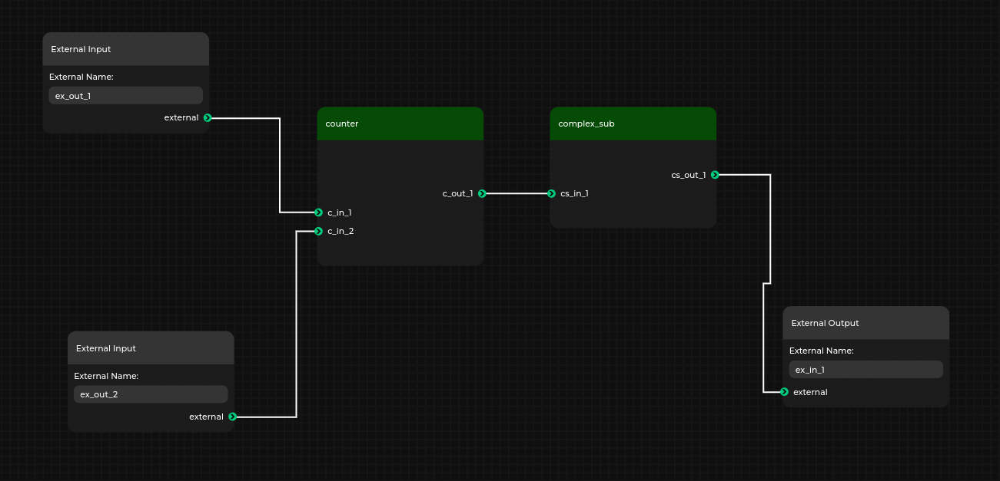
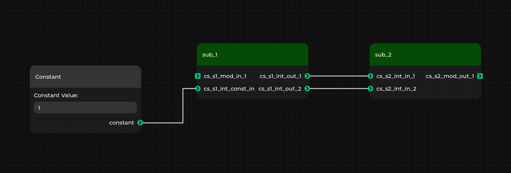

# Topwrap example: hierarchies

Copyright (c) 2024 [Antmicro](https://antmicro.com)

This example shows how to create a hierarchical design in Topwrap.
It contains a hierarchy containing some IP cores and nested hierarchies

For more information about hierarchies see [hierarchies docs](https://antmicro.github.io/topwrap/hierarchies.html)

## Usage
This example contains [user repo](https://antmicro.github.io/topwrap/user_repositories.html) (`repo` directory) and a configuration file for topwrap (`topwrap.yaml`) so it can be loaded by running
```
python -m topwrap kpm_client -d project.yml
```
in this example's directory.

Detailed information about loading user repositories and design files can be found [here](https://github.com/antmicro/topwrap/tree/main/examples/user_repository#usage).

## Expected result
There will be visible two subgraph nodes connected with `External Input` and `External Output`.



These subgraph nodes can be previewed by right clicking on them and selecting `Edit Subgraph`

`complex_sub` in this preview should look like this:


