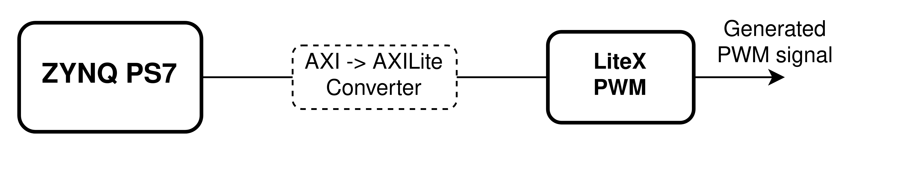

# Topwrap PWM example setup

Copyright (c) 2021-2024 [Antmicro](https://antmicro.com)

This is an example on how to use [Topwrap](https://github.com/antmicro/topwrap) to build a synthesizable design.

## Usage

Install Vivado and add it to your `PATH`.

Install example's dependencies:
<!-- name="install-deps" -->
```
pip install -r requirements.txt
```

### Generate bitstream for Zynq:

<!-- name="build" -->
```
make
```

### If you wish to generate HDL sources without running Vivado, you can use:

<!-- name="generate" -->
```
make generate
```

### Contents of the design

A PWM IP Core that can be generated with LiteX is connected to ZYNQ Processing System.
The Core uses AXILite interface, so a proper `AXI -> AXILite` converter is needed.
The generated signal can be used in FPGA or connected to a physical port on a board.



You can see how connections between IPs are made in `project.yml` file.
