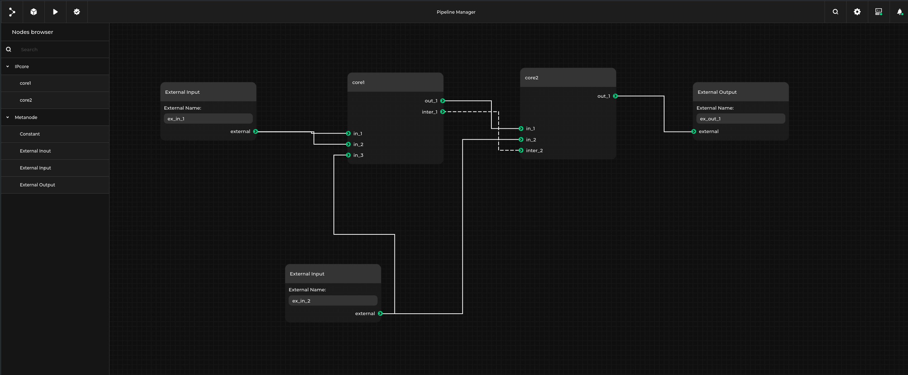

# Topwrap example: example_user_repository

Copyright (c) 2024 [Antmicro](https://antmicro.com)

This example presents a structure of a user repository that can be loaded with the use of `topwrap.yaml` config file.

For more information about the structure of user repository check [user repository docs](https://antmicro.github.io/topwrap/user_repositories.html)

## Usage

Build and run Pipeline Manager server

```
python -m topwrap kpm_build_server
python -m topwrap kpm_run_server
```

Navigate to `/examples/user_repository/` directory and run:

```
python -m topwrap kpm_client -d project.yml
```

Connect to the web GUI frontend in your browser on `http://127.0.0.1:5000`

### Expected result

Topwrap will load two cores from the `cores` directory that use an interface from the `interfaces` directory.

In the side panel under `IPcore` should be visible two loaded cores: `core1` and `core2`.

The loaded design should look like this:


